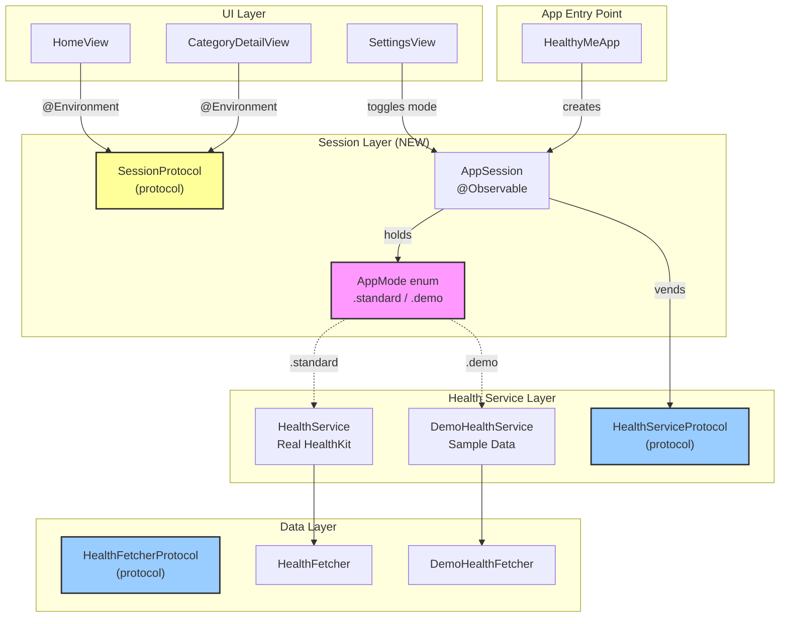
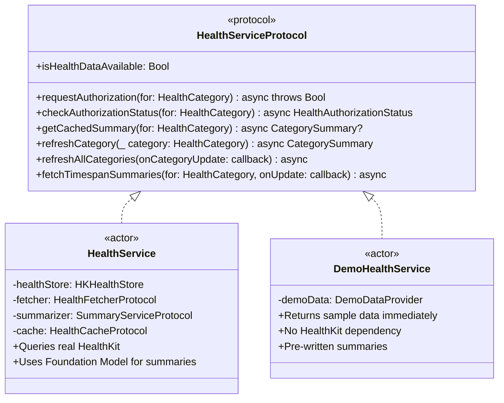
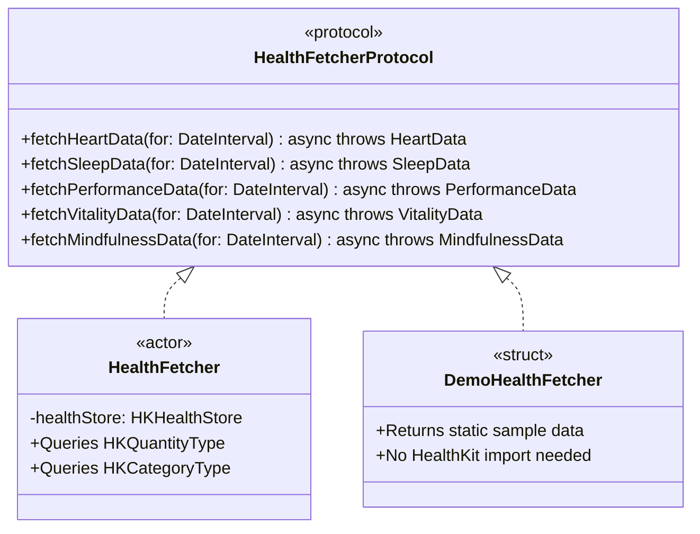

# Demo Mode Architecture Design

## Problem Statement

Apple App Store review requires verifiable functionality without real HealthKit data. We need a demo mode that:
- Displays realistic sample health data
- Is easily toggled by reviewers via Settings
- Is isolated from production code paths
- Is extensible for future modes (offline, lite, etc.)

---

## Proposed Architecture

### Session Protocol with Mode Enum

Rather than a simple boolean toggle, we introduce a `SessionProtocol` that manages the app's operating mode and vends appropriate service implementations.



---

## Protocol Definitions

### SessionProtocol (NEW)

```swift
/// Central protocol for app session management.
/// Controls operating mode and vends appropriate service implementations.
protocol SessionProtocol: Observable {
    /// Current operating mode of the app
    var currentMode: AppMode { get set }

    /// Health service appropriate for current mode
    var healthService: HealthServiceProtocol { get }

    /// Whether the app is in demo mode (convenience property)
    var isDemoMode: Bool { get }
}
```

### AppMode Enum (NEW)

```swift
/// Operating modes for the app.
/// Extensible for future modes like offline, lite, etc.
enum AppMode: String, CaseIterable {
    case standard   // Real HealthKit data
    case demo       // Sample data for App Store review

    // Future possibilities:
    // case offline  // Cached-only mode
    // case lite     // Limited feature set
}
```

---

## Protocols to Override for Demo Mode

### HealthServiceProtocol

The demo implementation must override all methods. Here's what each needs to do:



| Method | Demo Implementation |
|--------|---------------------|
| `isHealthDataAvailable` | Always returns `true` |
| `requestAuthorization(for:)` | Returns `true` immediately (no dialog) |
| `checkAuthorizationStatus(for:)` | Returns `.authorized` for all categories |
| `getCachedSummary(for:)` | Returns pre-built demo `CategorySummary` |
| `refreshCategory(_:)` | Returns demo data (simulates brief delay for realism) |
| `refreshAllCategories(onCategoryUpdate:)` | Iterates demo data, calls callback for each |
| `fetchTimespanSummaries(for:onUpdate:)` | Returns demo daily/weekly/monthly summaries |

### HealthFetcherProtocol

If `DemoHealthService` uses composition (recommended), it needs a `DemoHealthFetcher`:



| Method | Demo Data |
|--------|-----------|
| `fetchHeartData(for:)` | HR: 72 bpm, Resting: 58, HRV: 45ms |
| `fetchSleepData(for:)` | 7.5h total, 22% REM, 55% Core, 18% Deep |
| `fetchPerformanceData(for:)` | 8,432 steps, 4.2 mi, 320 cal |
| `fetchVitalityData(for:)` | 165 lbs, SpO2: 98%, Resp: 14/min |
| `fetchMindfulnessData(for:)` | 15 min total, 2 sessions |

---

## Implementation Files

```
HealthyMe/
├── Services/
│   ├── Session/                    # NEW
│   │   ├── SessionProtocol.swift
│   │   ├── AppSession.swift
│   │   └── AppMode.swift
│   ├── Health/
│   │   ├── HealthServiceProtocol.swift   # existing
│   │   ├── HealthService.swift           # existing
│   │   ├── HealthFetcherProtocol.swift   # existing
│   │   ├── HealthFetcher.swift           # existing
│   │   └── Demo/                         # NEW
│   │       ├── DemoHealthService.swift
│   │       ├── DemoHealthFetcher.swift
│   │       └── DemoDataProvider.swift
```

---

## Settings UI

Add a toggle in SettingsView:

```swift
Section("Developer") {
    Toggle("Demo Mode", isOn: $session.isDemoMode)

    if session.isDemoMode {
        Text("Showing sample data for App Store review")
            .font(.caption)
            .foregroundStyle(.secondary)
    }
}
```

---

## App Store Review Instructions

In App Store Connect → App Review Information → Notes:

> To review the app with sample health data:
> 1. Open the app
> 2. Go to Settings (gear icon)
> 3. Enable "Demo Mode" toggle
> 4. Return to Home to see sample health data

---

## Summary

| Component | Purpose | New/Existing |
|-----------|---------|--------------|
| `AppMode` | Enum for operating modes | NEW |
| `SessionProtocol` | Central session management | NEW |
| `AppSession` | Observable implementation | NEW |
| `DemoHealthService` | Sample data service | NEW |
| `DemoHealthFetcher` | Sample data fetcher | NEW |
| `DemoDataProvider` | Static sample health values | NEW |
| `HealthServiceProtocol` | Service interface | EXISTING |
| `HealthFetcherProtocol` | Fetcher interface | EXISTING |
