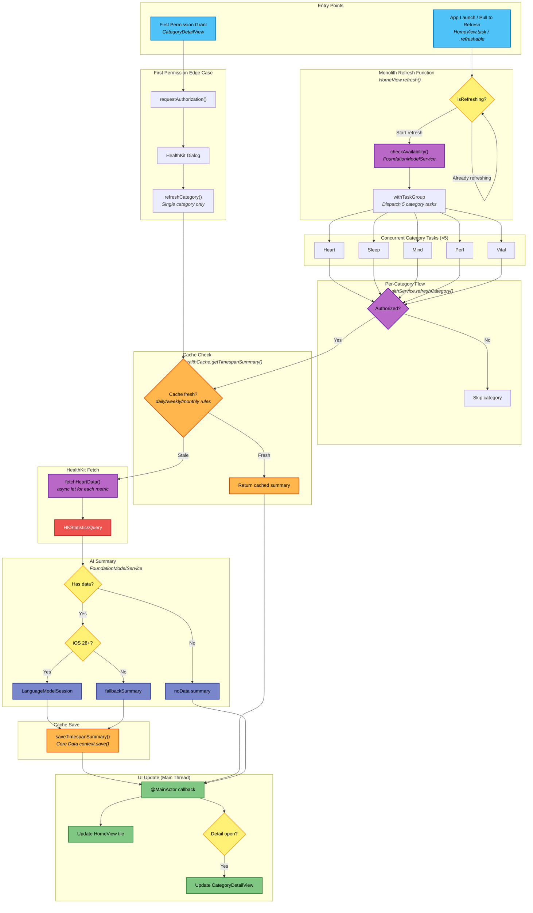
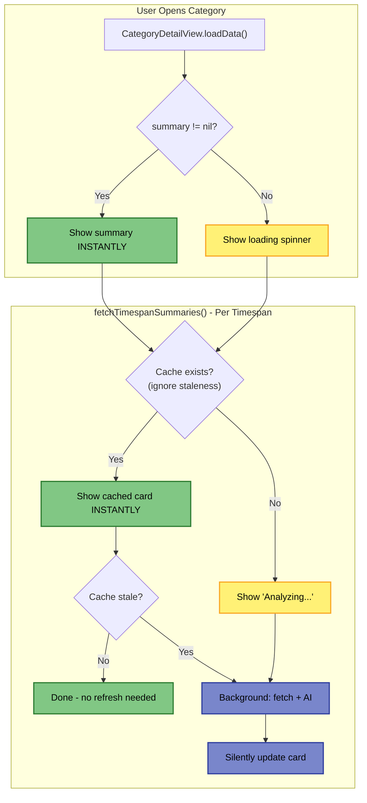

## Legend

| Color | Meaning |
|-------|---------|
| 🔵 Cyan | Entry points |
| 🟣 Purple | Service layer |
| 🟠 Orange | Cache (Core Data) |
| 🟢 Green | UI updates (@MainActor) |
| 🟡 Yellow | Decision points |
| 🔴 Red | HealthKit queries |
| 🔷 Indigo | AI/Foundation Model |

## Key Files

| File | Role |
|------|------|
| `HomeView.swift` | `refresh()` - unified monolith entry for launch + pull-to-refresh |
| `CategoryDetailView.swift` | `requestPermissionsAndRefresh()` - first permission edge case |
| `HealthService.swift` | `refreshCategory()`, `fetchTimespanSummaries()` - orchestration |
| `HealthFetcher.swift` | `fetchHeartData()` - HealthKit queries |
| `HealthCache.swift` | `getTimespanSummary()`, `saveTimespanSummary()` - Core Data |
| `FoundationModelService.swift` | `generateSummary()` - LLM or fallback |

## Cache Freshness Rules

| TimeSpan | Update Frequency |
|----------|------------------|
| Daily | Every day |
| Weekly | Every 3 days |
| Monthly | Once a week |

## Key Design Decisions

1. **Unified entry point**: App launch and pull-to-refresh use the same `refresh()` function
2. **isRefreshing guard**: Prevents concurrent refresh races
3. **Cache-first, no loading spinner**: Show cached data IMMEDIATELY - never show loading if cache exists
4. **Progressive UI**: Each category updates independently as it completes
5. **Actor isolation**: `HealthService` is an actor, `HealthCache` uses Core Data context for thread safety
6. **First permission edge case**: Only refreshes the single category, not the full monolith

## CategoryDetailView Caching Flow

**Critical Rules**:
1. **Main loading spinner**: ONLY if `summary == nil` (literally no cache exists)
2. **Card "Analyzing..."**: ONLY if `cache.getTimespanSummary() == nil` (literally no cache)
3. **Cache exists (even stale)** → show it INSTANTLY, then silently refresh in background
4. User should NEVER see loading/analyzing if ANY cached data exists